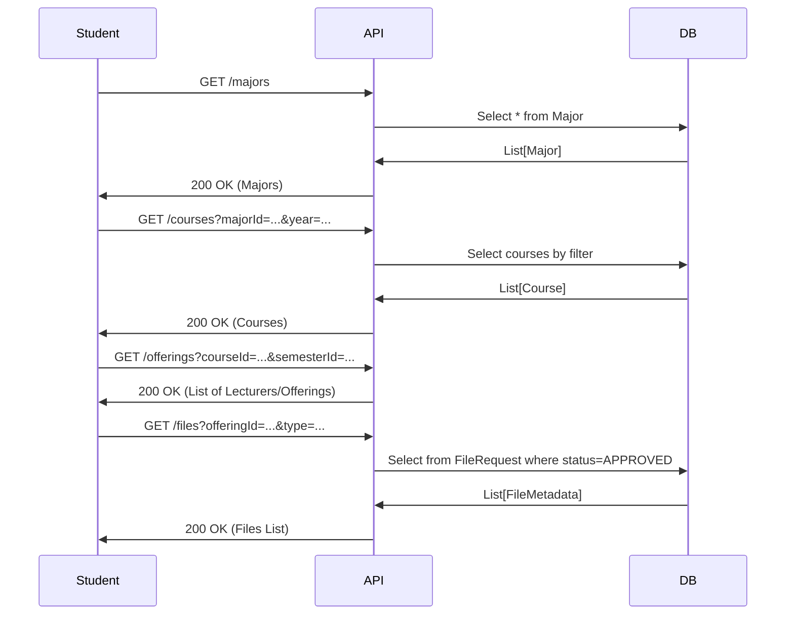
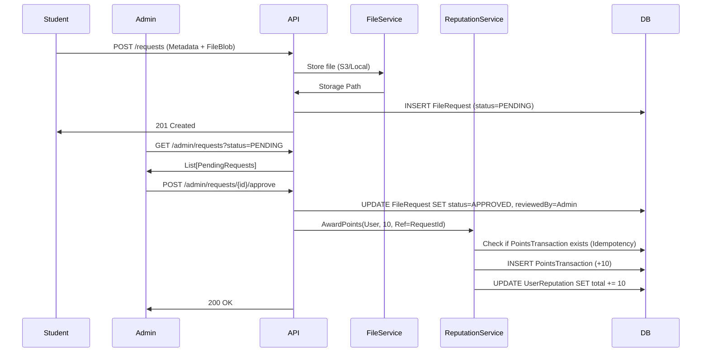

# GeeksHub Backend Product Requirements Document (PRD)

**Version:** 1.0.0
**Status:** Draft
**Author:** Antigravity (AI)
**Date:** 2025-12-26

---

## 1. Executive Summary

### Problem Statement
University students struggle to find high-quality, organized academic resources (slides, past papers, notes) for their specific courses and lecturers. Existing solutions are often disorganized (WhatsApp groups, Drive folders) or lack curation. There is no centralized, trusted repository where contributions are incentivized and quality is vetted.

### Goals
- Build a centralized, searchable academic library structured by the university's academic hierarchy.
- Implement a community-driven contribution system with a reputation engine to incentivize uploads.
- Ensure high content quality through a robust admin moderation workflow.
- Provide a responsive, public-read API for the frontend and mobile apps.

### Non-Goals
- Social networking features (messaging, friend requests).
- Real-time collaboration on documents.
- Hosting video lectures (scope limited to static files).

### Success Metrics
- **Upload Volume:** Number of file requests submitted per week.
- **Approval Time:** Average time from submission to admin decision (target < 24h).
- **Library Growth:** Total approved active files in the system.
- **API Latency:** p95 response time for browse endpoints < 200ms.

---

## 2. Users & Roles

### Roles
1.  **Student (Public/Authenticated User)**: Can browse materials. Authenticated students can upload files and view their reputation.
2.  **Admin**: Can view all pending requests, approve/reject files, and manage metadata (courses, lecturers).
3.  **Moderator (Optional/Future)**: Subset of admin permissions focused solely on file review.

### Permission Matrix

| Feature | Student (Anon) | Student (Auth) | Admin |
| :--- | :---: | :---: | :---: |
| Browse & Download Files | ✅ | ✅ | ✅ |
| Submit File Request | ❌ | ✅ | ✅ |
| View Own Requests | ❌ | ✅ | ✅ |
| View Pending Queue | ❌ | ❌ | ✅ |
| Approve/Reject Request | ❌ | ❌ | ✅ |
| Manage Core Metadata | ❌ | ❌ | ✅ |
| View Audit Logs | ❌ | ❌ | ✅ |

---

## 3. Core Entities (Data Model)

### Entity Relationship Summary
`Major` -(1:N)-> `Course`
`Course` + `Lecturer` + `Semester` -> `CourseOffering`
`CourseOffering` -(1:N)-> `File` (via approved requests)
`User` -(1:N)-> `FileRequest`
`User` -(1:1)-> `UserReputation`

1. Users & Reputation
Users (Identity & RBAC)
| Field | Type | Required | Unique | Description |
| :--- | :--- | :---: | :---: | :--- |
| id | UUID | Yes | Yes | Primary Key (PK) |
| auth0_id | String | Yes | Yes | Link to Auth0 Provider |
| email | String | Yes | Yes | University email |
| name | String | Yes | No | Full display name |
| role | String | Yes | No | student or admin |
| created_at | Timestamp | Yes | No | ISO 8601 |

Reputation Events (Points Ledger)
| Field | Type | Required | Unique | Description |
| :--- | :--- | :---: | :---: | :--- |
| id | UUID | Yes | Yes | PK |
| user_id | UUID | Yes | No | FK to Users |
| action | String | Yes | No | e.g., upload_approved |
| points | Integer | Yes | No | Positive/Negative amount |
| source_id | UUID | Yes | Yes | Idempotency Key (FK to FileRequest) |

2. Academic Catalog (Static)
Majors
| Field | Type | Required | Unique | Description |
| :--- | :--- | :---: | :---: | :--- |
| id | String | Yes | Yes | PK (Slug, e.g., software-engineering) |
| name | String | Yes | Yes | e.g., "Software Engineering" |

Courses
| Field | Type | Required | Unique | Description |
| :--- | :--- | :---: | :---: | :--- |
| id | UUID | Yes | Yes | PK (Internal ID) |
| code | String | Yes | Yes | College Code (e.g., "10036") |
| name | String | Yes | No | e.g., "Database Systems" |
| major_id | String | Yes | No | FK to Major |
| year_id | Integer | Yes | No | 1, 2, 3, or 4 |
| semester | Integer | Yes | No | 1 (Fall) or 2 (Spring) |

3. Files & Moderation
Material Types
| Field | Type | Required | Unique | Description |
| :--- | :--- | :---: | :---: | :--- |
| id | String | Yes | Yes | PK (slug: summary, exam, notes) |
| display_name| String | Yes | Yes | UI label |

File Requests (Staging Area)
| Field | Type | Required | Unique | Description |
| :--- | :--- | :---: | :---: | :--- |
| id | UUID | Yes | Yes | PK |
| user_id | UUID | Yes | No | FK to User (Uploader) |
| course_id | UUID | Yes | No | FK to Course |
| type_id | String | Yes | No | FK to MaterialType |
| title | String | Yes | No | User-defined title |
| lecturer | String | Yes | No | Associated instructor name |
| file_url | String | Yes | No | GCS Path (Pending Folder) |
| status | String | Yes | No | pending, approved, rejected |
| admin_note | String | No | No | Feedback from moderator |
| created_at | Timestamp | Yes | No | |

Files (Approved Public Catalog)
| Field | Type | Required | Unique | Description |
| :--- | :--- | :---: | :---: | :--- |
| id | UUID | Yes | Yes | PK (Preserved from Request ID) |
| title | String | Yes | No | |
| course_id | UUID | Yes | No | FK to Course |
| type | String | Yes | No | String label for UI performance |
| uploader_id | UUID | Yes | No | FK to User |
| file_url | String | Yes | No | GCS Path (Final Folder) |
| download_count| Integer | Yes | No | Default 0 |
| rating | Float | Yes | No | Default 0.0 |

## 4. Workflows

### 4.1 Browse Library

### 4.2 File Submission & Approval

---

## 5. REST API Spec

### Common
- Base URL: `/api/v1`
- Content-Type: `application/json`

### Public Endpoints (Browse)
| Method | Path | Auth | Description | Params |
| :--- | :--- | :--- | :--- | :--- |
| `GET` | `/majors` | None | List all majors | |
| `GET` | `/semesters` | None | List semesters | |
| `GET` | `/courses` | None | List courses | `majorId`, `yearId` |
| `GET` | `/courses/{id}/offerings` | None | List lecturers/offerings | `semesterId` |
| `GET` | `/files` | None | **Search/List files** | `courseId`, `offeringId`, `type`, `page`, `limit` |
| `GET` | `/files/{id}/download` | None | Get secure download URL | |

### Student Endpoints (My interactions)
| Method | Path | Auth | Description |
| :--- | :--- | :--- | :--- |
| `POST` | `/requests` | **Student** | Create file request. Body: `{ title, courseOfferingId, typeId, fileKey }` |
| `GET` | `/me/requests` | **Student** | List my submitted requests (all statuses). |
| `GET` | `/me/reputation` | **Student** | Get point total and transaction history. |

### Admin Endpoints (Moderation)
| Method | Path | Auth | Description |
| :--- | :--- | :--- | :--- |
| `GET` | `/admin/requests` | **Admin** | List requests. Query: `status=pending`. |
| `PATCH`| `/admin/requests/{id}/status` | **Admin** | Review request. Body: `{ status: "APPROVED" \| "REJECTED", reason: "..." }` |
| `POST` | `/admin/courses` | **Admin** | Create new course. |
| `POST` | `/admin/offerings` | **Admin** | Link Course+Lecturer+Semester. |

### Error Handling Standard
- `400 Bad Request`: Validation failure.
- `401 Unauthorized`: Missing token.
- `403 Forbidden`: Student trying to access Admin API.
- `404 Not Found`: Entity doesn't exist.
- `422 Unprocessable`: Logic error (e.g., duplicate request).

---

## 6. File Storage Abstraction
We must decouple metadata from physical storage.
- **Storage Strategy**: Object Storage (S3-compatible) or Local Filesystem (dev).
- **Naming Convention**: `uploads/{year}/{course_id}/{random_uuid}.{ext}` to prevent collision.
- **Pre-signed URLs**: API does not stream files. It generates a short-lived (5min) pre-signed URL for the frontend to download directly from storage (reduces load on backend).
- **Validation**:
  - Max size: 25MB.
  - Allowed Types: pdf, pptx, docx, jpg, png.

---

## 7. Consistency, Idempotency & Concurrency
- **Idempotency**: The `approve` endpoint must be idempotent. If an admin clicks approve twice, the reputation system must strictly enforce `unique_constraint(referenceId)` on `PointsTransaction` to prevent double-spending.
- **Concurrency**: Use database transactions for the Approval workflow:
  1. Lock `FileRequest` row.
  2. Verify status is `PENDING` (if already APPROVED/REJECTED, throw 409 Conflict).
  3. Update Status.
  4. Create Points Transaction.
  5. Commit.

---

## 8. Observability & Audit
- **Structured Logging**: Log every state change of `FileRequest`.
  - `[INFO] Request created: ID=xyz by User=123`
  - `[INFO] Request approved: ID=xyz by Admin=999. Points=+10`
- **Audit Table**: `ModerationLog` table (Who, What, When, Reason).
- **Metrics**:
  - `counter.requests.submitted`
  - `counter.requests.approved`
  - `counter.requests.rejected`
  - `latency.file.download`

---

## 9. Security & Privacy
- **Row Level Security**: Students can only see their own `PENDING` requests. `APPROVED` requests are public.
- **Anonymity**: Uploader names are visible by default, but we should support an `isAnonymous` flag in `FileRequest` if the student chooses to hide their name on the public file card.
- **Rate Limiting**: Limit `POST /requests` to 10 per hour per student to prevent spam.

---

## 10. Open Questions / Assumptions
1. **Assumption**: Auth is handled via an external provider (Firebase/Supabase/Auth0) and we just trust the JWT claims for `role` and `uid`.
2. **Q**: Do we need to support versioning of files? (Start with **No**, Immutable files. If update needed, delete + new upload).
3. **Q**: Do past semesters' files remain visible? (Assumption: **Yes**, historical browsing is a key feature).

---

## Definition of Done (DoD) Checklist
- [ ] Database schema migration scripts created and tested.
- [ ] API endpoints implemented with request/response validation.
- [ ] Unit tests for Reputation Service (ensure no double-counting).
- [ ] Integration tests for the full Request -> Approve -> Points flow.
- [ ] Admin dashboard API connected to frontend.
- [ ] CI/CD pipeline building and passing tests.
- [ ] Swagger/OpenAPI documentation generated.
